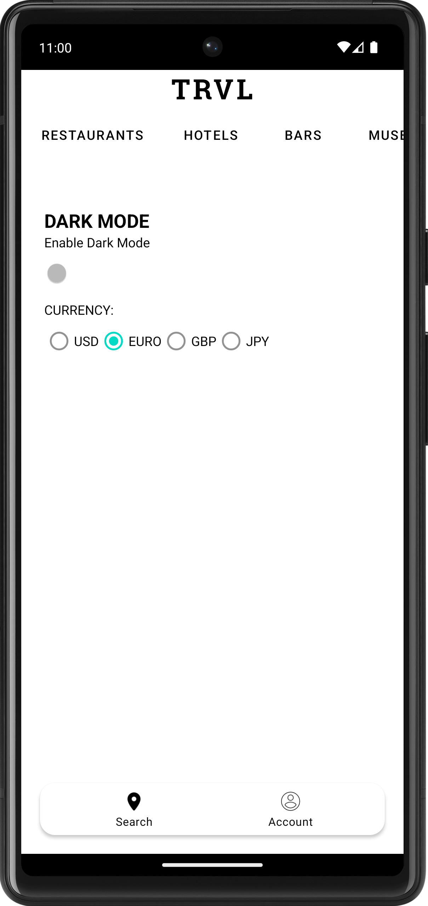

<!-- PROJECT LOGO -->
<br />
<div align="center">
    <h1>TRVL</h1>
  <h3 align="center">Travel Planning Application Built in Kotlin 💻</h3>
  <h6>( Requirements: Implement Google Maps, Shared Preferences, Retrofit, Moshi, and RecyclerView )</h6>
  <h6>( and create something cool! )</h6>
</div> 

<div align="center">
    
    
    
    
    <br>
    
    
    
    
</div>

<!-- TABLE OF CONTENTS -->
<details>
  <summary>Table of Contents</summary>
  <ol>
    <li><a href="#about-this-application">About The Project</a></li> 
    <li><a href="#built-with">Built With</a></li>
    <li><a href="#apis">APIs Used</a></li>
    <li><a href="#prerequisites">Getting Setup</a></li>
    <li><a href="#installation">Installation</a></li>
    <li><a href="#how-to-use-this-application">How To Use This Application</a></li>
    <li><a href="#maps-fragment">Maps Fragment</a></li>
    <li><a href="#viewmodel-and-data-persistence">ViewModel and Data Persistence</a></li>
    <li><a href="#code-reuse">Code Reuse</a></li>
    <li><a href="#swipe-and-undo-functionality-for-recyclerview-items">Swipe Functionality for RecyclerViewer</a></li>
    <li><a href="#account-fragment">Account Fragment</a></li>
    <li><a href="#contact">Contact</a></li>
    <li><a href="#errors">Errors</a></li>
    <li><a href="#acknowledgements">Acknowledgements</a></li>
  </ol>
</details>

--- 

## ABOUT THIS APPLICATION

My app is called **TRVL**, and for this project, I decided to build a travel application designed for travelers of all types, ranging from solo adventurers to family vacationers. The app aims to enhance the user’s travel experience by providing a one-stop solution for viewing, planning, and experiencing trips. It caters to users seeking personalized travel itineraries, local recommendations, and essential travel information to places and events locally or abroad.

The app addresses several pain points for everyday travelers when planning trips. It offers a convenient way to discover and book or make reservations at hotels or restaurants and displays a list of activities/events near the user’s current location using Geo-located Data Retrieval. With an intuitive interface, users can create customized itineraries based on their interests and preferences, making planning a trip enjoyable and efficient. The app also offers valuable insights into popular tourist attractions (or hidden gems), allowing travelers to immerse themselves fully in the destinations they visit.   

## Built With

* ##### KOTLIN - (Programming Language)
* ##### JETPACK - (Navigation)
* ##### ANDROID STUDIO - (IDE)
* ##### RETROFIT - (API Calls)
* ##### MOSHI - (JSON Parsing)
* ##### RECYCLERVIEW - (List Display)
* ##### MATERIAL DESIGN - (UI)
* ##### GOOGLE MAPS - (Map Display)
* ##### Overpass API - (API)

<p align="right">(<a href="#navigate-to-top">back to top</a>)</p>

---

## APIs

### APIs Used (Documentation):

* ##### [GOOGLE MAPS API](https://developers.google.com/maps/documentation/android-sdk)
* ##### [OpenStreetMap API (Overpass API)](https://wiki.openstreetmap.org/wiki/Map_Features)

<p align="right">(<a href="#navigate-to-top">back to top</a>)</p>

---

# 👋🏾 Getting Setup Locally

## Prerequisites

To get your program up and running properly you will need to install the following software:

* Android Studio
  ```sh
  https://developer.android.com/studio
  ```
* Android SDK
  ```sh
  https://developer.android.com/studio
    ```
* Google Maps API Key (Required)
  ```sh
  https://developers.google.com/maps/documentation/android-sdk/get-api-key
  ```
* Access to OpenStreetMap API (Required)

<p align="right">(<a href="#navigate-to-top">back to top</a>)</p>

---

## Installation

_Below is an example of how you can instruct your audience on installing and setting up your app.
This template doesn't rely on any external dependencies or services._

1. Clone the repo
   ```sh
   git clone https://github.com/<USERNAME>_/<PROJECT-NAME>.git
   ``` 
2. Open the project in Android Studio
   ```sh
    File -> Open -> Select the project folder
    ```
3. Sync project with gradle files
4. Run the project
5. Enjoy!

<p align="right">(<a href="#navigate-to-top">back to top</a>)</p>

---

## HOW TO USE THIS APPLICATION

## Maps Fragment

#### - Requirements Completed: Google Maps API, OpenStreetMap API, Geo-located Data Retrieval

# **Google Maps API Integration** and **OpenStreetMap API Integration**

At the start of the application the user is greeted with a splash screen that displays the app logo and name. The splash screen is displayed once and then persisted in the background, so that the next time the user opens the app, they are taken directly to the **MapsFragment**, as the **IntroActivity** is only launched once when, the app is first installed and permission has been granted to obtain the users location.

<div align="center">
    
    
</div>

Next, the user can view a map of their current locations and nearby places of interest, which is displayed using the **Google Maps API**. The user can also filter and view a list of nearby places of interest by clicking on the buttons located in the **TopMenuFragment** (e.g., Restaurants, Hotels, Bars, Museums). By default the user is shown a list of nearby restaurants. The list is displayed using **OpenStreetMap API** response, which is modeled in the RecyclerViewer to show the complete list of locations nearby. The user can also click on the map marker to view the name of the location and its lat/long coordinates to get a precise location.

<div align="center">
    
    
    
</div>


Positioned on top of the MapsFragment is a list button. This button allows the user to view the list of nearby places of interest as a **VERTICAL** list. The user can also click on the **BACK TO MAP** button to cycle between the **LocationListFragment** and the **MapsFragment**.  

<div align="center">
    
    
</div>

Each item in the list is clickable and will launch the **TodoActivity**, which displays the details of the location, including the name, address, phone number, and the potential to make a reservation or booking at that location.

<div align="center">
    
</div>

<p align="right">(<a href="#navigate-to-top">back to top</a>)</p>

* Code snippet for setting up **Retrofit** and **Moshi** and getting the response from API call:

```
    private val retrofit by lazy {
        Retrofit.Builder()
            .baseUrl("https://overpass-api.de/")
            .addConverterFactory(MoshiConverterFactory.create())
            .build()
    }
    private val service by lazy {
        retrofit.create(OverpassService::class.java)
    }
```

* Code snippet for **handling permissions** to access user's location:

```
    private fun hasLocPermission() =
        ActivityCompat.checkSelfPermission(
            requireContext(),
            Manifest.permission.ACCESS_FINE_LOCATION
        ) == PackageManager.PERMISSION_GRANTED
```

```
       override fun onMapReady(googleMap: GoogleMap) {
        mMap = googleMap.apply {
            setOnMapClickListener { latLng ->
                marker?.position =
                    latLng // Add a marker to the clicked location or move the existing marker to the clicked location
            }
        }
        when {
            hasLocPermission() -> getLoc()
            shouldShowRequestPermissionRationale(Manifest.permission.ACCESS_FINE_LOCATION)
            -> {
                showPermissionRationale {
                    requestPermissionLauncher.launch(Manifest.permission.ACCESS_FINE_LOCATION)
                }
            }

            else -> requestPermissionLauncher.launch(Manifest.permission.ACCESS_FINE_LOCATION)
        }
    }
```

* Code snippet to **clear** map markers and **fetch new API response for MapsFragment** data on button click in TopMenuFragment:
```
    mMap.clear() 
    
    // Dynamically change the location type based on the button clicked and user's current location
    
    val data = """
    [out:json];
    (
        node["$type"="$locationSelected"]
            (${currentLocation.latitude - 0.1},${currentLocation.longitude - 0.1},
            ${currentLocation.latitude + 0.1},${currentLocation.longitude + 0.1});
    );
    out;
""".trimIndent()

    CoroutineScope(Dispatchers.IO).launch {
        try {
            val response = service.getLocations(data)
            withContext(Dispatchers.Main) {
                val mapLocations = mutableListOf<LatLng>()
                var count = 0 

                if (response != null) {
                    for (element in response.elements) {
                        val userLocation = LatLng(element.lat, element.lon)
                        mapLocations.add(userLocation)

                        val markerOptions = MarkerOptions()
                            .position(userLocation)
                            .title(element.tags.name)
                            .snippet("Lat: ${element.lon}, Long: ${element.lat}")

                        queryIconSelected(locationSelected, markerOptions)
                        mMap.addMarker(markerOptions)

                        count++
                    }
                }
                if (mapLocations.isNotEmpty()) {
                    val builder = LatLngBounds.Builder()
                    for (location in mapLocations) {
                        builder.include(location)
                    }
                    val bounds = builder.build()
                    mMap.animateCamera(CameraUpdateFactory.newLatLngBounds(bounds, 100))
                    getLocationList(response)
                }
            }
        } catch (e: Exception) {
            Log.e(TAG, "Error querying locations: ${e.message}")
        }
    }
}
```

---

# Account Fragment + Top Menu Fragment
## ViewModel and Data Persistence: 
* #### **PreferenceViewModel**, **PreferenceWrapper**, **LocationsViewModel**, **Querying Locations**and **LocationType**

The **PreferenceViewModel** (ViewModel) class manages user preferences related to the app. Its primary purpose is communicating with my **PreferenceWrapper** class to store and retrieve user preferences from **shared preferences**. This ViewModel class uses **LiveData** to **observe** user preferences changes and update the UI accordingly. I also implemented a **LocationsViewModel** class for this app, which uses **MutableLiveData** called **_Location**. This is used to communicate between fragments (**TopMenuFragment** and **MapsFragment**). This **LiveData**  is classified as a read-only property queryLocation, which the MapsFragment will constantly observe. Its use is limited to tracking when a user selects a specific location type from the TopMenuFragment. Once a location is determined, the **LocationsViewModel** updates the **_Location** **LiveData** with the selected location type. This alone will trigger the observation in the MapsFragment, which then fetches and displays new locations based on the user's current **_Location** and the desired location type.


<div align="center">
    
    
    
    
</div>

* Code snippet for LocationsViewModel to communicate and observe location changes and update the type and selected location:
```
    locationsViewModel =
        ViewModelProvider(requireActivity()).get(LocationsViewModel::class.java)
    locationsViewModel.queryLocation.observe(viewLifecycleOwner) { selected ->
        val type = when (selected) {
            "restaurant", "bar" -> "amenity"
            "hotel", "attraction", "museum" -> "tourism"
            else -> "amenity"
        }
        fetchAndDisplayLocations(userLocation, type, selected)
    }
    fetchAndDisplayLocations(userLocation, DEFAULT_TYPE, DEFAULT_LOCATION)
}
```

* Code snippet for LocationsViewModel to manage and communicate location changes between MapsFragment and TopMenuFragment:
```
class LocationsViewModel : ViewModel() {

    private val _Location = MutableLiveData<String>()

    val queryLocation: LiveData<String>
        get() = _Location

    fun setLocationQuery(location: String) {
        _Location.value = location
    }
}

```

# Overview of Account Fragment and Data Persistence
When using this application, the user can customize their experience by selecting their preferred currency type and dark mode setting. This can be done through the account fragment, where the user can choose their currency type from a list of radio buttons and adjust the dark mode setting using a switch widget. The selected values will determine the application's color scheme and the currency symbol displayed in the RecyclerViewer for each location. These customizations will remain consistent throughout the use of the application.

### Data Persistence
I utilized the **PreferenceViewModel** class to manage user preferences such as dark mode preference, selected currency, and initial app usage, which are updated from the AccountFragment. The **PreferenceViewModel** cooperates with the **PreferenceWrapper** to store and retrieve these preferences from the app's shared preferences. To handle UI-related data storage, the PreferenceViewModel employs LiveData. To ensure that the dark mode preference persists, I developed a custom function called **saveDarkModeEnabled()** that returns a **LiveData** of type Boolean. Whenever the dark mode switch is toggled in the AccountFragment, the **saveDarkModeEnabled()** function is activated to store the dark mode preference with the help of **LiveData**.

### Account Fragment
The **PreferenceViewModel** uses **LiveData** to keep track of changes in the dark mode preference. Whenever the app is opened or resumed, the AccountFragment keeps an eye on this preference and updates the UI automatically if the choice is changed. To achieve this, the **PreferenceViewModel** is initialized in the AccountFragment using a custom Factory to pass the **PreferenceWrapper**. This ViewModel is responsible for setting up the current view's dark mode switch and currency radio buttons **(US, EURO, GBP, JPY)**. Whenever the user interacts with these elements, the functions in the **PreferenceViewModel** are called to save the user preferences, and LiveData is used to update the UI accordingly. The user can select their preferred currency type and dark mode setting through the account fragment. The chosen values will determine the color scheme and currency symbol displayed in the RecyclerViewer for each location, and these customizations will remain consistent throughout the use of the application.


<div align="center">
    
    
    <br>
    
    
</div>


* Code snippet for setting up the dark mode switch and currency radio buttons in the AccountFragment, and persisting user selection using the PreferenceViewModel:
```
private fun setupDarkModeSwitch(view: View) {
        switchWidget.setOnClickListener {
            val isDarkModeEnabled = switchWidget.isChecked
            preferenceViewModel.isDarkModeEnabled(isDarkModeEnabled)
            preferenceViewModel.saveDarkModeEnabled()

            val textColor = if (isDarkModeEnabled) Color.WHITE else Color.BLACK
            setTextViewColor(view, textColor)

            val backgroundColor = if (isDarkModeEnabled) Color.BLACK else Color.WHITE
            generalLayout.setBackgroundColor(backgroundColor)

            val window = requireActivity().window
            window.statusBarColor = ContextCompat.getColor(requireActivity(), R.color.black)

            modeSelectedMessage(isDarkModeEnabled)
        }

        preferenceViewModel.saveDarkModeEnabled()
            .observe(viewLifecycleOwner, Observer { isDarkModeEnabled ->
                switchWidget.isChecked = isDarkModeEnabled
                val textColor = if (isDarkModeEnabled) Color.WHITE else Color.BLACK
                setTextViewColor(view, textColor)

                val backgroundColor = if (isDarkModeEnabled) Color.BLACK else Color.WHITE
                generalLayout.setBackgroundColor(backgroundColor)
            })
    }
```

* Code snippet for setting up the currency radio buttons in the AccountFragment, and persisting user selection using the PreferenceViewModel:
```
private fun setupCurrencyRadioButtons() {
        // TODO-d: This function will be called when the radio button is clicked and will save the currency to the shared preferences
        listOfRadioButtons.forEach { radioButton ->
            radioButton.setOnClickListener {
                val currency = radioButton.text.toString()
                preferenceViewModel.saveCurrency(currency)
            }
        }
        preferenceViewModel.getSelectedCurrency()
            .observe(viewLifecycleOwner, Observer { selectedCurrency ->
                listOfRadioButtons.forEach { radioButton ->
                    if (radioButton.text.toString() == selectedCurrency) {
                        radioButton.isChecked = true
                    }
                }
            })
    }
```

For the light/dark mode preference, I decided to store it to enhance the user experience by providing a seamless and personalized interface. Users can choose the mode that suits their needs, and the app will consistently load in their preferred mode, providing a cohesive visual experience throughout each interaction. Regarding the currency type, I chose to persist it so that users don't need to repeatedly set their preferred currency each time they use the app. With data persistence, the app can store the user's currency choice, allowing the currency type to be loaded and utilized throughout different application sections, making the data displayed more consistent.

<p align="right">(<a href="#navigate-to-top">back to top</a>)</p>

---

## CODE REUSE

For **Project 03**,  I decided to reuse a similar setup for **Retrofit, Moshi,** and the **API service class** from **Project 02**. This also made reusing my custom RecyclerViewer, ViewModel, and Adapter classes from **Project 02** significantly easier to integrate into Project 03 as it only required slightly reconfiguring the layout to get things working as intended. Reusing these elements and incorporating them into this project worked perfectly for displaying the list of locations provided by the Overpass API.

Being able to reuse these elements and classes provides the user with the ability to view a complete list of available locations using data received from the **Overpass API**, and display each location based on the user's current location. Using the user’s precise location provides a unique experience when using and engaging with the content of the application.

<div align="center">
</div>

<p align="right">(<a href="#navigate-to-top">back to top</a>)</p>

---

## Contact

Name:  William Hellems-Moody
<br>
Project
Link: [https://github.com/willMoody/project-03](https://github.com/msu-denver/project-03-an-advanced-android-application-lab01-group-33)

<p align="right">(<a href="#navigate-to-top">back to top</a>)</p>

---

## Errors

If program is not running after compiling, try the following:

1. Clean Project
2. Rebuild Project
3. Invalidate Caches/Restart
4. Sync Project with Gradle Files
5. Restart Android Studio
6. Restart Computer
7. Reinstall Android Studio

---
<div align="center">

</div>
Upon getting the following error related to iCloud, repeat the steps above or try the following:

1. Find the duplicate file in the project directory
2. Delete the duplicate file
3. Clean Project
4. Rebuild Project
5. Invalidate Caches/Restart
6. Sync Project with Gradle Files
7. Rerun Project
8. Enjoy!

<p align="right">(<a href="#navigate-to-top">back to top</a>)</p>

---

## Acknowledgments

* [GitHub Copilot](https://github.com/features/copilot/)
* [Android Developer Guides](https://developer.android.com/guide)
* [Android Basics in Kotlin](https://developer.android.com/courses/android-basics-kotlin/course)
* [Figma](https://www.figma.com)

---

## API Sources

* [Android Developer | Filter - Documentation](https://developer.android.com/reference/android/widget/Filter)
* [Android Developer | LiveData - Documentation](https://developer.android.com/topic/libraries/architecture/livedata)

* [Android Developer | ViewModel - Documentation](https://developer.android.com/topic/libraries/architecture/viewmodel)

* [Android Developer | RecyclerView - Documentation](https://developer.android.com/reference/androidx/recyclerview/widget/RecyclerView)

* [Google Maps Platform | Documentation](https://developers.google.com/maps/documentation/android-sdk)

* [Open Street Map | Documentation](https://wiki.openstreetmap.org/wiki/API_v0.6)

* [Open Street Map | Overpass API](https://wiki.openstreetmap.org/wiki/Overpass_API)

<p align="right">(<a href="#navigate-to-top">back to top</a>)</p>

---